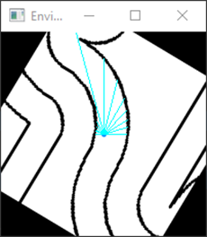
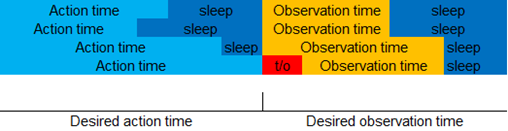
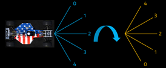

# TrackMania_AI
Neural network driver for Trackmania
## Intro and goals
Computer vision and self-driving cars are one of the most common topics in ML/AI nowadays. As I am new in the ML/AI world, I wanted to experiment and play with AI cars.
I played Trackmania when I was young and figured that it could be a good environment for this project.\
New goal is to make a competitive driver (against other AI's) and, hopefully, advance this project to the real car (we have already tested a supervised net on an RC car, gif below).\
If you have any ideas, comments or improvements, let me know.

https://github.com/AndrejGobeX/TrackMania_AI/assets/59582195/624187c4-6711-44eb-a405-e26500cd79ee

## Details
**This branch deals with a new gymnasium env for reinforcement algorithms. Please view the old `main` branch for supervised, neuroevuolution and old reinforcement algorithms.**

The `TrackmaniaEnv.py` file implements the new env for RL. You can tweak the number of previous observations and actions that will be stacked into the next observation.

| Elements | Observation                           | Min   | Max  |
|----------|---------------------------------------|-------|------|
|  2  | previous action(s) (steer, throttle/brake) | -1.0  | 1.0  |
|  1  | velocity of the car                        |  0.0  | 1.0  |
|  1  | wall contact                               |  0.0  | 1.0  |
| 13  | wall distances                             |  0.0  | 1.0  |

Depending on the values you enter when you instantiate the gym environment, these inputs will get stacked together that many times. This is to account for the real-time nature of the game.

This is how the agent sees the track:

  

Also, I have included a mechanism that tries to equalize the duration of inference and perception (it's just a timer and a sleep function, more in the comments of the gym).
This is, not only to fix the random delays, but to equalize timestep duration across different algorithms for comparison. Timeouts occur rarely and do not affect the performance of the agents.

  

I have also implemented a flipping mechanism that mirrors the track on each episode. This prevents overfitting in the earlier stages of training and effectively doubles the number of scenarios from which the agents can learn.

  

This gym implements a simplified version of the reward function presented in a paper by Florian Fuchs, Yunlong Song, Elia Kaufmann, Davide Scaramuzza, and Peter Dürr ([Super-Human Performance in Gran Turismo Sport Using Deep Reinforcement Learning](https://rpg.ifi.uzh.ch/docs/RAL21_Fuchs.pdf)). In the video([link](https://youtu.be/Zeyv1bN9v4A)) it can be seen how good the AI performs.
## Old supervised approach
**Switch to the old `main` branch**

The dataset is split into two categories: third_person and first_person, based on the camera.\
Networks are located in `Engines/` directory.
For now, I've made two supervised networks. Each of them outputs a 4-number array which represents probabilities of certain arrow keys being pressed (0.0 - 1.0). Threshold for each of the arrows can be tweaked independetly. ~In the future, it will be tied to the model.~\
*Neptune* is a convolutional network containing two conv2d layers. It just takes a 50x50 modded image and pops out four probabilities.\
\
*Maniack*, on the other hand, uses a 10-number vector as input. It represents normalized distances from the bottom of the modded image to the nearest black pixel above. This can be enhanced by using more lines and using horizontal distances measured from the middle, which I might try next time.\
\
Both of these networks have shown good results and are realtively quickly trained. However, in order to get to human-like results, they require a bigger (way bigger) dataset, with a better driver (I am not that bad :), but in order for these networks to be very good, you would need nearly perfect runs).
## Results
This repo is still in development, but I would like to showcase current results:
| Track | My Best | SAC (best) | SAC (avg) | PPO (best) | PPO (avg) | TD3 (best) | TD3 (avg) |
|-------|---------|------------|-----------|------------|-----------|------------|-----------|
|Nascar2| 14.348  |16.180      | 18.287    | 19.126     |19.367     | 16.247     |17.791     |
| Test2 | 12.728  |14.109      | 16.196    | 14.174     |14.655     | 17.894     |18.758     |
| Night | 10.124  |10.576      | 13.220    | 10.668     |10.999     | 10.728     |11.474     |
## Contents
| Filename | Brief description |
| -------- | ----------------- |
| MapExtractor/Program.cs | C# code that extracts track edges from a .gbx map file |
| Commands.py | Wrappers for game keys and virtual gamepad |
| DirectKey.py | Contains ctypes functions for key presses ( *pip packages won't work* ) |
| GameDataGetter.py | Class for getting in game data (speed, distance, etc.) |
| MapExtractor.py | Converts .txt files processed by C# script into an array |
| RL_Driver.py | Demo driver script |
| RL_Trainer.py | Demo trainer script |
| TrackmaniaEnv.py | Gym environment |
| TrackVisualizer.py | Visualizes the track and returns wall distances |
## Setup
**YOU DO NOT NEED STANDARD/CLUB ACCESS TO USE OPENPLANET AND THIS PROJECT.**\
If Openplanet won't load the plugin, try running Trackmania from .exe or use Ubisoft Connect.
1. Download Trackmania and Python with all the necessary packages (package info below).
2. Download Openplanet and install it.
3. Git clone this repository.
3. Copy the `TMRL_GrabDataExt.op` file from `Scripts\` directory to `C:\Users\(username)\OpenplanetNext\Plugins`. (If there is no `Plugins` directory in `OpenplanetNext`, run Trackmania and exit it)
4. Run Trackmania, press `F3` to open Openplanet, go to Openplanet > Log and check if the script is running (should print Waiting for incomming connection). You can, if necessary, reload the plugin from Developer > Reload plugin. Open any map (if you wish to use your own maps, you need to preprocess them with `MapExtractor\Program.cs`), and enter driving mode. Press `F3` again to close the openplanet overlay.
5. Optionally, change to windowed mode to make your life easier.
6. Edit the `RL_Driver.py` and `RL_Trainer.py` to point to the maps you want to drive on and chose the algorithm you like.
6. Run `python RL_Driver.py`. Note that you should use the map file of the track you are currently on.
## RC Car preview

More on the old `main` branch
## Credits
Big thanks to:
* Yann and Edouard (@trackmania-rl) for making the script for openplanet. I have included the licence and copyright notice with those files in the `Scripts\` directiory.
* Petr (@BigBang1112) for making a library that is used to extract track data from a map file.
* Antonin, Ashley, Adam, Anssi, Maximilian and Noah (@DLR-RM) for making Stable-Baselines3 used to apply reinforcement learning algorithms with ease.
* Everyone from Openplanet (@openplanet-nl) for creating the API used to extract in-game data from Trackmania.

If I missed quoting someone, please open an issue and I will update this page.
## Packages
The pip freeze output of the packages:
* matplotlib==3.7.1
* stable-baselines3==2.0.0
* opencv-python==4.7.0.72
* pywin32==306
* vgamepad==0.0.8
* torch==2.1.0.dev20230628+cu121 (nightly cuda 12.1)

All other packages should be installed automatically as dependencies.